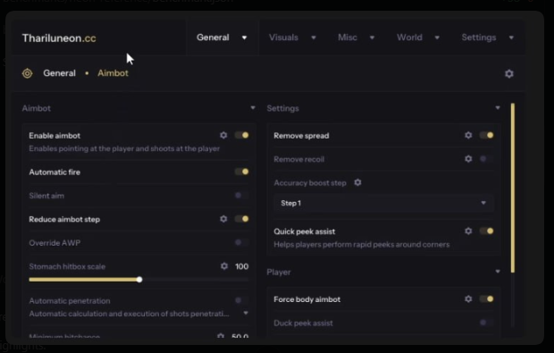
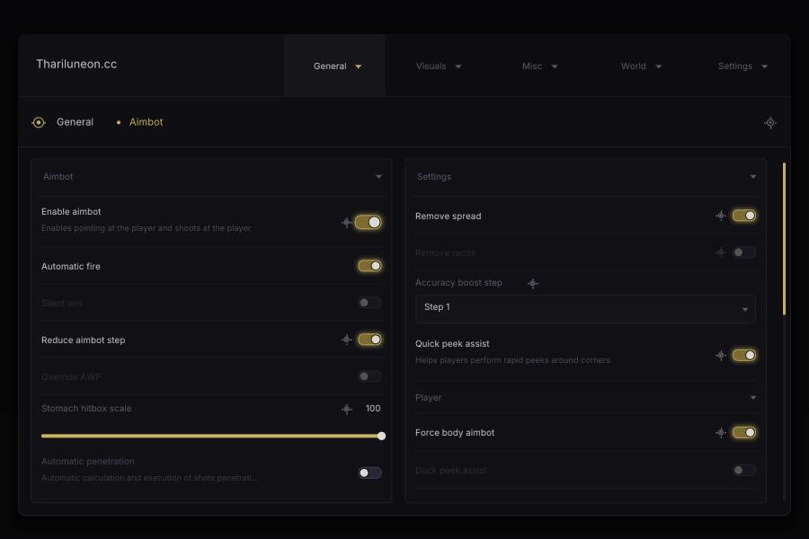
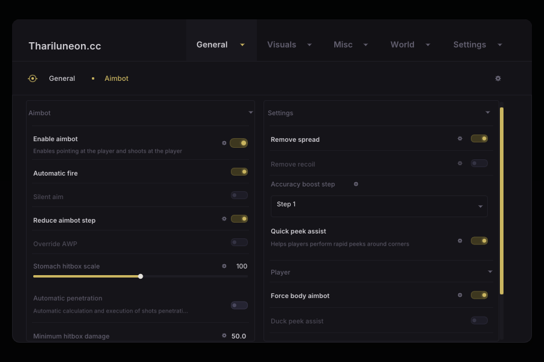
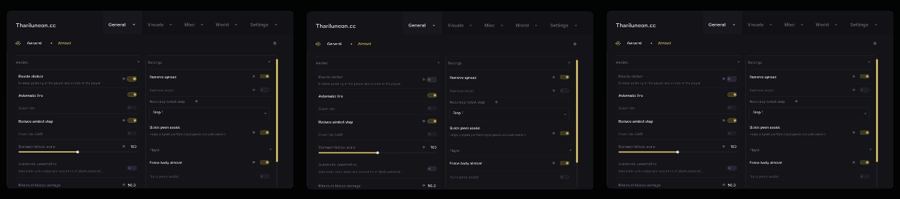

# ImGui Studio

> Give AI agents a real visual feedback loop for polished, animated Dear ImGui menus.

ImGui Studio is a local-first, AI-native development environment for creating custom Dear ImGui
menus in real C++. It gives an agent the same practical loop that makes website vibe coding work:
change code, render the result, inspect what happened, interact with it, and refine the design.

The canonical preview compiles the project's C++ and Dear ImGui to WebAssembly. The same
project menu and widget source is compiled into the Windows native parity fixture and included
in native exports. HTML or JSON widget recreations are not the source of truth.

## The problem

AI agents are good at website UI because they can see the page they wrote and iterate quickly.
Traditional Dear ImGui work breaks that loop: an agent often reaches for stock widgets with a few
style colors, cannot verify spacing or clipping, cannot observe an animation settle, and depends on
the developer to compile, run, screenshot, and report every issue.

Polished ImGui interfaces need more than `ImGuiStyle`. They use custom item registration, hit
testing, `ImDrawList` geometry, persistent animation state, authored fonts and icons, and careful
control of every state. A browser mockup is not enough if the native C++ menu will render
differently.

## The solution

ImGui Studio keeps the agent in a real C++ loop. It edits project source, builds Dear ImGui to an
isolated WebGL2 canvas, uses screenshots and structured widget data to evaluate the result, and
exports the exact successful source and assets to a native CMake package. The project previewed in
the browser is the project integrated into the native application.

## Showcase: reference-driven custom ImGui

This starter is a real C++/Dear ImGui remake of a compact settings-menu reference. Every visible
surface—the panels, typography, vector icons, compact toggles, slider, scrollbar, clipping, and
motion—is drawn by custom project code. The final image below is captured from the promoted
WebAssembly/WebGL2 preview; the same menu source also passes the Windows DirectX 11 parity gate.

| Reference supplied to Studio                                                   | First custom pass                                                                                        |
| ------------------------------------------------------------------------------ | -------------------------------------------------------------------------------------------------------- |
|  |  |

### Final design



The first pass establishes the custom component composition. The final pass measures and recreates
the reference's geometry, authored Inter font weights, darker palette, miniature gear icons,
localized toggle illumination, mid-range slider value, and deliberately asymmetric scrollbar gutter.
See [examples/starter/README.md](examples/starter/README.md) for the component and asset details.

### Deterministic interaction and motion

The filmstrip below is captured from a clean browser preview while the custom `settings.enable`
toggle transitions. The same scenario can be replayed by an agent or test without relying on wall
clock time or hand-reported screenshots.



## Why this works for ImGui vibe coding

- **The agent sees the real result.** The preview is real Dear ImGui C++ compiled to WebAssembly,
  not an HTML, CSS, canvas, JSON, or screenshot substitute.
- **Custom widgets are first-class.** Agents can author `ImDrawList` controls, custom hitboxes,
  vector icons, fonts, and deterministic tween/spring animation instead of stopping at recolored
  `ImGui::Checkbox()` calls.
- **Vision is paired with facts.** Screenshots show visual quality; stable widget IDs, bounds,
  interaction state, clipping information, animation values, and diagnostics make corrections
  precise.
- **References become iteration targets.** Import a reference image, align and crop it without
  altering the source image, then inspect side-by-side, overlay, absolute-difference, or
  edge-difference artifacts.
- **The final menu is adoptable.** Browser and Windows native hosts compile the same project source
  and font inputs. A parity gate catches unexplained geometry drift before export.

## The agent loop

1. Give the agent a written brief and optional reference images.
2. The agent reads and patches focused C++ menu, widget, theme, state, asset, or scenario files.
3. Studio builds the changed project and promotes a replacement preview only after compile, link,
   artifact validation, and smoke initialization succeed.
4. The agent uses the real browser canvas or stable widget IDs to inspect, click, drag, type, and
   test hover, disabled, active, and transition states.
5. It captures screenshots or deterministic filmstrips, inspects geometry and diagnostics, and
   compares the result to the reference.
6. When the design and behavior hold up, Studio exports the immutable successful revision as native
   C++ source, assets, runtime support, and CMake integration material.

## Agent and MCP workflow

The local service exposes the canonical versioned HTTP API. Its thin MCP-compatible standard-I/O
adapter maps the same operations into agent tools, so an agent does not need to infer state from
console prose or guess coordinates from a screenshot.

| Agent capability                  | What it enables                                                                     |
| --------------------------------- | ----------------------------------------------------------------------------------- |
| `source_read` / `source_patch`    | Read and apply revision-safe, bounded C++ edits.                                    |
| `build_preview` / `preview_load`  | Build real WebAssembly and replace a preview only when it is ready.                 |
| `render_frame` / `perform_action` | Drive the real menu with deterministic time or stable widget targets.               |
| `inspect_widgets`                 | Read bounds, interaction state, clipping, animation values, and diagnostics.        |
| `capture_animation`               | Produce replayable screenshots, filmstrips, and normalized traces.                  |
| `compare_reference`               | Generate side-by-side, overlay, absolute-difference, and edge-difference artifacts. |
| `export_project`                  | Package the exact successful C++ revision for native integration.                   |

Start Studio with `npm run studio`. A trusted launcher can then provide the per-launch credential to
`npm run agent-adapter`; see [apps/agent-adapter/README.md](apps/agent-adapter/README.md) for its
MCP-compatible transport and [AGENT_TOOL_API.md](AGENT_TOOL_API.md) for the versioned contracts.

## What is available now

| Capability               | What makes it useful                                                                                                                     |
| ------------------------ | ---------------------------------------------------------------------------------------------------------------------------------------- |
| Real browser preview     | Dear ImGui C++ runs in an isolated WebGL2 canvas, letting agents and humans inspect the actual draw-list output.                         |
| Custom component runtime | Stable interaction registration, `ImDrawList` rendering, authored fonts/assets, and deterministic tween/spring state.                    |
| Visual verification      | Browser screenshots, deterministic filmstrips, widget inspection, diagnostics, reference alignment, and comparison artifacts.            |
| Safe local iteration     | Revision-safe patches, bounded diagnostics, immutable successful builds, smoke-gated preview replacement, and last-known-good retention. |
| Native confidence        | The Windows DirectX 11 fixture compiles the same source and checks browser/native geometry at the fixed benchmark configuration.         |
| Native export            | A successful immutable build can be assembled into a deterministic CMake integration package with its declared assets and licenses.      |

## Status and scope

Phase 6 is complete. The repository includes the authenticated local project service, Monaco C++
editor, atomic revision-safe patches, incremental/cancellable Emscripten builds, structured compiler
diagnostics, immutable artifacts, smoke-gated preview replacement, and last-known-good preview
retention. The shared C++ runtime adds deterministic microsecond time, resettable tween/spring
state, stable custom-widget interaction, timeline controls, and repeatable filmstrip traces. The
starter includes a managed theme, validated licensed assets, portable visual effects, and a custom
component set for a cohesive polished menu. Successful immutable builds can now be exported as
deterministic native CMake packages, clean-built against pinned Dear ImGui, and checked against the
canonical browser preview with the two-pixel geometry gate. See
[docs/phase-6-completion.md](docs/phase-6-completion.md) for evidence.

The Phase 7 external benchmark/release gate is not yet passed: it requires independent agent runs
and blinded human review. See [docs/phase-7-readiness.md](docs/phase-7-readiness.md) for the exact
remaining evidence rather than treating the implemented capability set as a release claim.

## Prerequisites

- Windows x64
- Node.js 24.12.0
- npm 11.6.2
- CMake 4.3.2
- Visual Studio 2022 with MSVC 19.44.35223 and the Desktop C++ workload
- Git 2.45.0 or newer

Emscripten 4.0.10 is required for the browser foundation and can be installed locally with the
checked-in bootstrap script.

## Quick start

```powershell
npm ci
npm run verify:toolchain
npm run validate
```

Install and verify browser tooling:

```powershell
.\toolchain\bootstrap-emscripten.ps1
. .\.tools\emsdk\emsdk_env.ps1
node .\scripts\verify-toolchain.mjs --profile wasm
.\toolchain\emscripten\build-preview.ps1
npm run test:browser
npm run studio
```

Fetch and verify the pinned Dear ImGui source for development:

```powershell
.\toolchain\bootstrap-dependencies.ps1
```

## Common commands

| Command                      | Purpose                                                  |
| ---------------------------- | -------------------------------------------------------- |
| `npm ci`                     | Reproduce the pinned npm dependency graph                |
| `npm run validate`           | Run the complete native quality gate                     |
| `npm run test:ts`            | Run TypeScript/schema contract tests                     |
| `npm run test:cpp`           | Build and test the C++ foundation and native parity host |
| `npm run test:browser`       | Exercise and capture the real WASM preview in Chromium   |
| `npm run compare:captures`   | Compare browser/native captures and write a PNG diff     |
| `npm run preview:serve`      | Serve the shell and preview on separate loopback origins |
| `npm run studio`             | Start the authenticated editor and local service         |
| `npm run test:phase2`        | Run the build/preview/inspection/export service gate     |
| `npm run test:studio`        | Run the Monaco edit/build/stale-preview browser journey  |
| `.\toolchain\run-native.ps1` | Open the persistent interactive Win32/DX11 preview       |
| `npm run schemas:generate`   | Regenerate TypeScript types from canonical JSON Schemas  |
| `npm run schemas:check`      | Fail if generated schema types are stale                 |
| `npm run licenses:check`     | Fail if npm dependency license inventory is stale        |
| `npm run format:cpp:check`   | Validate C++ with the pinned clang-format                |
| `npm run format`             | Apply repository formatting                              |
| `npm run clean`              | Remove repository-local build output                     |

## Documentation

- Product requirements: [PRD.md](PRD.md)
- System architecture: [TECHNICAL_DESIGN.md](TECHNICAL_DESIGN.md)
- Delivery plan: [MVP_IMPLEMENTATION_PLAN.md](MVP_IMPLEMENTATION_PLAN.md)
- Development workflow: [docs/development.md](docs/development.md)
- Toolchain setup: [docs/operations/toolchain.md](docs/operations/toolchain.md)
- Contribution standard: [CONTRIBUTING.md](CONTRIBUTING.md)
- Known limitations: [docs/known-limitations.md](docs/known-limitations.md)
- Phase 7 release readiness: [docs/phase-7-readiness.md](docs/phase-7-readiness.md)
- Agent instructions: [AGENTS.md](AGENTS.md)

## Security warning

Opening and building a Studio project executes a local C++ toolchain. Review projects from
untrusted sources before building. The MVP is not a sandbox for malicious native source code.

## Licensing

The first-party project license has not yet been selected. No permission to redistribute
first-party source is granted by this repository at this stage. Third-party dependency licenses
are recorded in [THIRD_PARTY_NOTICES.md](THIRD_PARTY_NOTICES.md) and
`THIRD_PARTY_DEPENDENCIES.json`.
